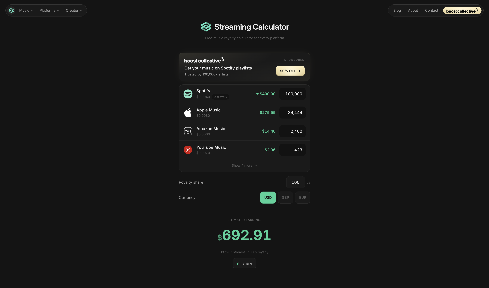
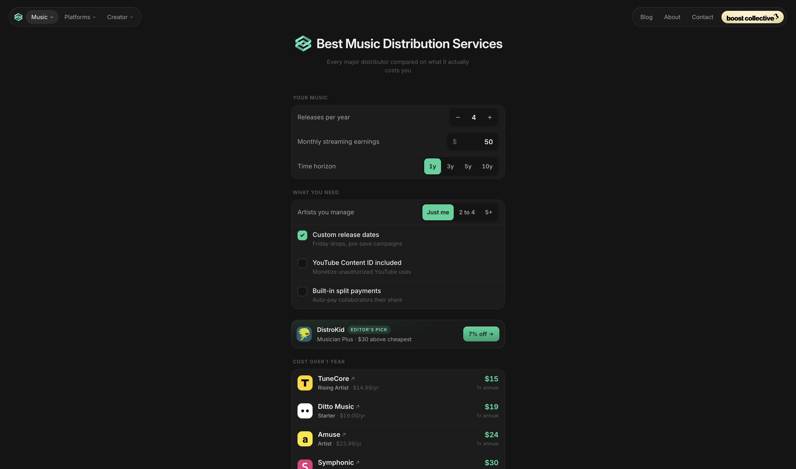

# Streaming Calculator

[](https://streamingcalculator.com)
[](https://github.com/filpgc/streaming-calculator/actions/workflows/ci.yml)

An independent creator-tools platform that turns opaque platform economics into useful, understandable calculations. It reaches approximately **20k views per month**, has earned around **800 backlinks**, and is designed, built and operated by [Filippo Piggici](https://github.com/filpgc).



## About this public repository

This repository is a deliberately separated, GitHub-only showcase mirror of the private production codebase. It is not a second deployment of Streaming Calculator; the only live product is [streamingcalculator.com](https://streamingcalculator.com).

The live product contains commercial sponsor configuration, campaign terms, first-party analytics results, private operational dashboards and account-specific Cloudflare deployment settings. Those details do not belong in a public portfolio repository. This edition preserves the product architecture, calculators, typed content model, interaction patterns, representative placement logic and Worker boundaries while replacing or omitting production-only data.

It exists so the engineering and product decisions can be reviewed without exposing partner or visitor information.

## At a glance

| | |
| --- | --- |
| **Reach** | Approximately 20k views per month and 800 backlinks |
| **Product surface** | 39 product and content page templates, including dynamic country variants |
| **System** | 32 reusable Svelte components and 85 typed content/data modules |
| **Editorial** | 50+ long-form guides connected to the same product data |
| **Stack** | Svelte 5, SvelteKit, TypeScript, Tailwind CSS 4 and Cloudflare Workers |
| **Ownership** | Product design, frontend, content system, SEO, performance and monetisation |

## The problem

Streaming rates, distribution fees and creator-platform payouts are fragmented across incompatible models. Most tools either hide their assumptions or turn a simple calculation into a thin SEO page.

Streaming Calculator treats the calculation as a product. Each surface keeps assumptions close to the result, uses the interaction pattern appropriate to that platform, and makes the next decision—comparing distributors, setting an earnings target or understanding a payout—easy to take.

## What I built

- Multi-platform royalty calculations for Spotify, Apple Music, Amazon Music, YouTube Music, Tidal and Deezer.
- Country-aware royalty and YouTube calculators generated from shared typed data.
- Reverse tools that turn an earnings target into the streams required to reach it.
- A distributor comparison that models the actual cost of release frequency, earnings, time horizon and required features.
- YouTube, TikTok and Twitch tools with platform-specific assumptions instead of one generic formula.
- A royalty-advance calculator, comparison pages and more than 50 editorial guides.
- Contextual sponsor slots and first-party aggregate click measurement on Cloudflare.



## Product system

### One interaction language

Calculators, comparisons and editorial pages share compact controls, currency handling, result patterns and a consistent visual hierarchy. A new tool is assembled from established primitives rather than designed as another mini-product.

### Useful estimates, explicit assumptions

Rates vary by country, subscription mix, audience and revenue model. The interface exposes those variables and describes every result as an estimate instead of presenting false precision.

### Content and calculators from the same source

Platform rates, distributor plans, countries and editorial sections live in typed data modules. Interactive results and high-intent landing pages therefore stay consistent, and broad rate or pricing changes remain auditable.

### Commercial without compromising the utility

Placements resolve at relevant decision points rather than interrupting the task. A page supplies its audience, slot and calculation context; the resolver selects an eligible placement deterministically, avoids category duplication and leaves unsold inventory useful through appropriate affiliate fill.

Outbound links pass through small Worker routes that record aggregate events before redirecting. Personal income figures, stream counts and user identities are not stored. Production campaign terms, raw analytics and operational queries are intentionally excluded from this public copy.

## Architecture

```text
src/
├── lib/components/      Shared calculators and product primitives
├── lib/data/            Typed rates, distributors, editorial and example placements
├── lib/stores/          Calculator state and currency conversion
└── routes/              Product pages, content, redirects and Worker endpoints
static/                  Platform, brand and social assets
```

SvelteKit supplies server-rendered and prerendered routes, while Cloudflare handles the small runtime boundary: contextual redirects and privacy-conscious aggregate events. The bulk of the experience remains fast, cacheable HTML rather than a client-heavy application shell.

## SEO and performance

Search is part of the product architecture rather than an afterthought:

- Shared data generates platform, comparison and country-specific surfaces without duplicating business logic.
- Structured data, canonical metadata, sitemap, robots, RSS and `llms.txt` routes are maintained in the application.
- Editorial content links back into the calculators at the point where the reader can act.
- Self-hosted fonts, responsive assets and deliberately limited client JavaScript keep the core interaction lightweight.
- The resulting domain has grown to roughly 20k monthly views and around 800 backlinks.

## Stack

- Svelte 5 and SvelteKit
- TypeScript
- Tailwind CSS 4
- Cloudflare Workers and Analytics Engine
- Vite
- Svelte Check, ESLint and Prettier

## Run locally

Requires Node.js 22.12 or newer.

```bash
npm ci
npm run dev
```

The development server is available at `http://localhost:5173` by default.

## Quality checks

```bash
npm run check
npm run lint
npm run build
```

## Public-copy boundaries

The checked-in Wrangler configuration targets a development Worker and uses example Analytics Engine bindings only. This repository does not include:

- production routes, account identifiers or secrets;
- sponsor contracts, commercial rates or unreleased partner proposals;
- raw click, audience or earnings-band datasets;
- the private sponsor-performance dashboard;
- live analytics tokens or operational access configuration.

## Source terms

This repository is public for technical review and portfolio visibility. No open-source licence is granted; all rights are reserved.
